# 🎙️ AI Voice Agent

A production-grade, real-time AI voice conversation agent built with **Node.js**. It enables natural, human-like voice interactions using **Deepgram** for speech-to-text & text-to-speech, **Grok LLM** for intelligent responses, and a **WebSocket** pipeline for ultra-low-latency bidirectional audio streaming — complete with sentence-level streaming, barge-in interruption support, automatic error recovery, and comprehensive latency tracking.

**Author:** Pratham Makhija

---

## Table of Contents

- [Features](#features)
- [Project Structure](#project-structure)
- [High-Level Architecture](#high-level-architecture)
- [Data Flow Pipeline](#data-flow-pipeline)
- [Sentence-Level TTS Streaming](#sentence-level-tts-streaming)
- [Barge-In (Interruption) Support](#barge-in-interruption-support)
- [Retry & Error Recovery](#retry--error-recovery)
- [Client Auto-Reconnect](#client-auto-reconnect)
- [AudioWorklet Processing](#audioworklet-processing)
- [Latency Metrics & Tracking](#latency-metrics--tracking)
- [Conversation Memory](#conversation-memory)
- [AI Persona System](#ai-persona-system)
- [Requirements Implementation](#requirements-implementation)
- [Installation](#installation)
- [Configuration](#configuration)
- [Usage](#usage)
- [Client Interface](#client-interface)
- [WebSocket Protocol](#websocket-protocol)
- [API & Services Reference](#api--services-reference)
- [Troubleshooting](#troubleshooting)
- [Tech Stack](#tech-stack)

---

## Features

| Feature                    | Description                                                                          |
| -------------------------- | ------------------------------------------------------------------------------------ |
| 🗣️ **Real-time STT**       | Deepgram Nova-2 streaming transcription with interim results & VAD                   |
| 🧠 **LLM Integration**     | Grok (X.AI) via OpenAI-compatible API — easily swappable to OpenAI/Anthropic         |
| 👤 **AI Persona**          | "Nova" — a friendly, voice-optimized assistant with consistent personality           |
| 💾 **Conversation Memory** | Sliding window + optional LLM-powered summarization for context compaction           |
| 🔊 **Sentence-Level TTS**  | Deepgram Aura TTS with sentence-by-sentence streaming for faster time-to-voice       |
| ⚡ **Barge-In Support**    | Users can interrupt the AI mid-response with voice — server-side cancellation        |
| 🔄 **Retry Logic**         | Exponential backoff with jitter on all external API calls (LLM & TTS)                |
| 📡 **Auto-Reconnect**      | Client automatically reconnects on disconnect with exponential backoff               |
| 🎛️ **AudioWorklet**        | Modern browser audio capture on a dedicated thread (ScriptProcessor fallback)        |
| 📊 **Latency Metrics**     | End-to-end pipeline latency tracking: STT → LLM → TTS per request                    |
| 🌐 **WebSocket Streaming** | Binary audio + JSON control protocol with chunked delivery & heartbeat               |
| 🛡️ **Error Handling**      | Graceful degradation, STT reconnection, fallback TTS responses, process-level guards |

---

## Project Structure

```
ai-voice-agent/
├── app.js                              # Main orchestrator — connects all services
├── audio-processor.js                  # AudioWorklet processor (browser mic capture)
├── client.html                         # Browser-based test client (full-featured)
├── package.json                        # Project metadata & dependencies
├── .env                                # Environment variables (API keys)
├── .gitignore                          # Git ignore rules
├── README.md                           # This file
└── src/
    ├── config/
    │   └── config.js                   # Central configuration (API keys, models, settings)
    ├── ws/
    │   └── wsHandler.js                # WebSocket server (binary audio + JSON control)
    ├── services/
    │   ├── deepgram/
    │   │   ├── stt.js                  # Deepgram streaming Speech-to-Text
    │   │   └── tts.js                  # Deepgram Text-to-Speech (with retry)
    │   ├── llm/
    │   │   ├── provider.js             # LLM provider abstraction (with retry)
    │   │   └── persona.js              # AI persona definition & system prompt
    │   └── memory/
    │       └── conversationMemory.js   # Per-session conversation history management
    └── utils/
        ├── retry.js                    # Exponential backoff retry utility
        └── metrics.js                  # Latency metrics tracking & reporting
```

---

## High-Level Architecture

```mermaid
graph TB
    subgraph Browser["🖥️ Browser Client"]
        MIC[🎤 Microphone]
        SPK[🔊 Speaker]
        AW[AudioWorklet / ScriptProcessor]
        UI[Transcript & Response UI]
        RC[Auto-Reconnect Logic]
    end

    subgraph Server["⚙️ Node.js Server"]
        WS[WebSocket Handler]
        APP[App Orchestrator]

        subgraph Services["Services"]
            STT[Deepgram STT<br/>Nova-2 Streaming]
            TTS[Deepgram TTS<br/>Aura Asteria]
            LLM[Grok LLM<br/>Streaming + Retry]
            PER[Nova Persona<br/>System Prompt]
            MEM[Conversation Memory<br/>Sliding Window]
        end

        subgraph Utils["Utilities"]
            RET[Retry Logic<br/>Exp. Backoff + Jitter]
            MET[Latency Metrics<br/>Per-Request Tracking]
        end
    end

    subgraph External["☁️ External APIs"]
        DG_STT[Deepgram STT API]
        DG_TTS[Deepgram TTS API]
        GROK[X.AI Grok API]
    end

    MIC --> AW --> WS
    WS --> SPK
    WS --> UI
    RC -.->|reconnect| WS

    WS <--> APP
    APP <--> STT
    APP <--> TTS
    APP <--> LLM
    LLM --> PER
    LLM --> MEM

    STT <-->|WebSocket| DG_STT
    TTS -->|HTTP + Retry| DG_TTS
    LLM -->|HTTP + Retry| GROK

    RET -.->|wraps| TTS
    RET -.->|wraps| LLM
    MET -.->|tracks| APP
```



---

## Data Flow Pipeline

The complete journey of a single voice interaction, from user speech to AI audio response:

```mermaid
sequenceDiagram
    participant U as 🎤 User (Browser)
    participant WS as WebSocket
    participant STT as Deepgram STT
    participant LLM as Grok LLM
    participant MEM as Memory
    participant TTS as Deepgram TTS
    participant SPK as 🔊 Speaker

    Note over U,SPK: User speaks a sentence

    U->>WS: Binary audio frames (linear16, 16kHz)
    WS->>STT: Forward audio chunks

    loop Real-time Transcription
        STT-->>WS: Interim transcript
        WS-->>U: Display partial text
    end

    STT->>WS: Final transcript + UtteranceEnd
    WS->>U: Display final text

    Note over WS,MEM: Process complete utterance

    WS->>MEM: Store user message
    MEM->>MEM: Apply sliding window / summarize
    MEM-->>LLM: Conversation history

    WS->>U: { type: "thinking" }

    loop Sentence-Level Streaming
        LLM-->>WS: Stream tokens
        WS->>WS: Buffer into sentences

        alt Sentence complete
            WS->>U: { type: "speaking" }
            WS->>TTS: Synthesize sentence
            TTS-->>WS: Audio chunks
            WS->>SPK: Stream audio immediately
        end
    end

    WS->>MEM: Store assistant response
    WS->>U: { type: "audio_end" }
    WS->>U: Full text response
```



---

## Sentence-Level TTS Streaming

Unlike a traditional pipeline that waits for the complete LLM response before starting TTS, this agent streams LLM tokens, buffers them into sentences, and sends each sentence to TTS **immediately** — dramatically reducing time-to-first-voice.

```mermaid
graph LR
    subgraph Traditional["❌ Traditional Pipeline"]
        direction LR
        T1[Wait for full<br/>LLM response] --> T2[Send entire text<br/>to TTS] --> T3[Wait for full<br/>audio] --> T4[Play audio]
    end

    subgraph Optimized["✅ Sentence-Level Pipeline"]
        direction LR
        O1[Stream LLM<br/>tokens] --> O2[Buffer into<br/>sentences]
        O2 -->|Sentence 1| O3A[TTS → 🔊 Play]
        O2 -->|Sentence 2| O3B[TTS → 🔊 Play]
        O2 -->|Sentence 3| O3C[TTS → 🔊 Play]
    end
```



**How it works:**

1. LLM streams tokens via `streamResponse()` async generator
2. Tokens are buffered until a sentence-ending character (`. ! ? \n`) is detected
3. Each complete sentence is sent to `tts.streamSynthesize()` immediately
4. TTS audio chunks are forwarded to the client as they arrive
5. The user hears the first sentence while the LLM is still generating the rest

**Key code path:** `app.js` → `processUserMessage()` → sentence buffering loop

---

## Barge-In (Interruption) Support

Users can interrupt the AI mid-response by speaking. The system cancels all in-flight processing (LLM streaming + TTS) and immediately starts listening to the new input.


**How it works:**

1. Each response gets an `AbortController` + `AbortSignal`
2. If the STT detects speech while `isProcessing === true`, `abortCurrentResponse()` is called
3. The abort signal propagates to:
   - LLM streaming loop → breaks the `for await` loop
   - TTS synthesis → skips sending remaining audio chunks
4. Server sends `{ type: 'audio_interrupted' }` to the client
5. Client calls `stopAudioPlayback()` to halt the audio source node
6. Partial response is saved to memory with `[interrupted]` suffix

**Client-side interrupt:** The client also supports explicit interrupt via the `{ type: 'interrupt' }` control message.

---

## Retry & Error Recovery

All external API calls are wrapped with an intelligent retry mechanism featuring exponential backoff and jitter to handle transient failures gracefully.

```mermaid
flowchart TD
    START[API Call] --> ATTEMPT{Attempt N}
    ATTEMPT -->|Success| DONE[✅ Return Result]
    ATTEMPT -->|Error| CHECK{Retryable Error?}

    CHECK -->|Yes & attempts left| WAIT[⏳ Wait with backoff]
    CHECK -->|No| FAIL[❌ Throw Error]
    CHECK -->|Max retries reached| FAIL

    WAIT --> COMPUTE["delay = min(initialDelay × 2^attempt, maxDelay)<br/>+ random jitter (0-30%)"]
    COMPUTE --> ATTEMPT

    subgraph "Retryable Errors"
        E1[408 Request Timeout]
        E2[429 Rate Limited]
        E3[500 Internal Server Error]
        E4[502 Bad Gateway]
        E5[503 Service Unavailable]
        E6[Network: ECONNRESET, ETIMEDOUT]
    end
```



**Configuration:**

| Service        | Max Retries | Initial Delay | Max Delay |
| -------------- | ----------- | ------------- | --------- |
| LLM (Grok)     | 3           | 500ms         | 10s       |
| TTS (Deepgram) | 3           | 300ms         | 10s       |

**Key utility:** `src/utils/retry.js` — exports `withRetry()`, `isRetryableError()`, `wrapWithRetry()`

**Jitter formula:** `jitter = delay × random(0, 0.3)` — prevents thundering herd on simultaneous retries.

---

## Client Auto-Reconnect

The browser client automatically reconnects if the WebSocket connection drops, using exponential backoff with a maximum of 10 attempts.


**Backoff schedule:**

| Attempt | Delay     |
| ------- | --------- |
| 1       | 1s        |
| 2       | 2s        |
| 3       | 4s        |
| 4       | 8s        |
| 5       | 16s       |
| 6+      | 30s (max) |

**Features:**

- `intentionalDisconnect` flag prevents reconnect on user-initiated close
- Reconnecting state shown in the UI with attempt counter
- All pending audio is cleared on disconnect
- Session state resets on successful reconnect

---

## AudioWorklet Processing

Modern browsers use an **AudioWorklet** running on a dedicated audio thread for microphone capture, avoiding the main-thread blocking of the legacy ScriptProcessor API. A fallback to ScriptProcessor is included for older browsers.

```mermaid
flowchart TD
    MIC[🎤 Microphone] -->|getUserMedia| STREAM[MediaStream]

    STREAM --> CHECK{AudioWorklet<br/>Supported?}

    CHECK -->|Yes| AW_LOAD[Load audio-processor.js<br/>as AudioWorklet module]
    AW_LOAD --> AW_NODE[AudioWorkletNode<br/>on Audio Thread]
    AW_NODE --> BUFFER[Buffer 4096 samples]
    BUFFER --> CONVERT[Float32 → Int16 PCM]
    CONVERT --> PORT[MessagePort.postMessage]
    PORT --> WS[Send via WebSocket]

    CHECK -->|No or Error| SP[ScriptProcessor<br/>on Main Thread]
    SP --> CONVERT2[Float32 → Int16 PCM]
    CONVERT2 --> WS

    style AW_NODE fill:#4caf50,color:#fff
    style SP fill:#ff9800,color:#fff
```



**Why AudioWorklet?**

- Runs on a **separate audio rendering thread** — no jank or dropped frames
- Consistent buffer sizes (4096 samples) for smooth streaming
- Better performance under heavy main-thread load (UI updates, etc.)

**Fallback:** If `audioContext.audioWorklet` is undefined or module loading fails, the system gracefully falls back to `createScriptProcessor(4096, 1, 1)`.

**File:** `audio-processor.js` — `MicrophoneProcessor` class extending `AudioWorkletProcessor`

---

## Latency Metrics & Tracking

Every voice interaction is measured across the full pipeline, providing detailed latency breakdowns for monitoring and optimization.


**Tracked metrics per request:**

| Metric                 | What It Measures                                    |
| ---------------------- | --------------------------------------------------- |
| `sttLatency`           | Time from request start to STT transcript complete  |
| `llmFirstTokenLatency` | Time to first LLM token (time-to-first-byte)        |
| `llmLatency`           | Total LLM generation time                           |
| `ttsFirstChunkLatency` | Time to first TTS audio chunk (time-to-first-voice) |
| `ttsLatency`           | Total TTS synthesis time                            |
| `endToEnd`             | Full pipeline: STT → LLM → TTS complete             |

**Session statistics:** The system maintains running min/max/average for each metric across all requests in a session. Stats are logged when a session ends.

**File:** `src/utils/metrics.js` — `LatencyMetrics` class with `startRequest()`, `mark*()`, `finalizeRequest()`, `getSessionStats()`

---

## Conversation Memory

Per-session conversation history with two strategies for managing context length:

```mermaid
flowchart TD
    MSG[New Message] --> ADD[Add to History]
    ADD --> CHECK{History > maxMessages?}

    CHECK -->|No| DONE[✅ Pass full history to LLM]

    CHECK -->|Yes| STRATEGY{Strategy?}

    STRATEGY -->|Sliding Window| TRIM["Remove oldest messages<br/>Keep last N (default: 20)"]
    TRIM --> DONE

    STRATEGY -->|Summarization| SUMMARIZE[Send oldest messages<br/>to LLM for summarization]
    SUMMARIZE --> COMPACT["Replace old messages<br/>with summary paragraph"]
    COMPACT --> PREPEND["Prepend: Previous context summary"]
    PREPEND --> DONE
```



**Features:**

- Isolated per-session storage (multiple concurrent users supported)
- Configurable `maxMessages` threshold (default: 20)
- `useSummarization` toggle — when enabled, older messages are compressed via LLM rather than dropped
- Active session tracking with `getActiveSessions()`

---

## AI Persona System

"**Nova**" is a pre-defined AI personality injected as the system prompt for every LLM request.

**Persona traits:**

- 🤗 **Friendly & Warm** — uses casual, approachable language
- 🎯 **Concise** — keeps responses to 2-4 sentences (voice-optimized)
- 🗣️ **Conversational** — uses natural speech patterns, contractions, filler words
- 📖 **No Visual Content** — never outputs markdown, code blocks, lists, or URLs
- 🧠 **Context-Aware** — references previous conversation points naturally

The persona is defined in `src/services/llm/persona.js` and integrated via `getSystemPrompt()` which returns the system message prepended to every LLM call.

---

## Requirements Implementation

### 1. Deepgram Streaming STT

| Aspect        | Implementation                                                   |
| ------------- | ---------------------------------------------------------------- |
| **File**      | `src/services/deepgram/stt.js`                                   |
| **API**       | `listen.live()` WebSocket streaming                              |
| **Model**     | Nova-2 with smart formatting & punctuation                       |
| **VAD**       | Voice Activity Detection with `utterance_end_ms: 1000`           |
| **Events**    | `Transcript` (interim + final), `UtteranceEnd`, `Error`, `Close` |
| **Reconnect** | Exponential backoff: 1s → 2s → 4s → 8s → 10s cap, max 5 attempts |

### 2. LLM Integration

| Aspect            | Implementation                                                        |
| ----------------- | --------------------------------------------------------------------- |
| **File**          | `src/services/llm/provider.js`                                        |
| **Provider**      | Grok (X.AI) via `https://api.x.ai/v1`                                 |
| **Package**       | `openai` npm (X.AI provides OpenAI-compatible API)                    |
| **Streaming**     | `streamResponse()` async generator, `streamAndCollect()`              |
| **Non-Streaming** | `generateResponse()` for single-shot requests                         |
| **Retry**         | `withRetry()`: 3 retries, 500ms initial, exponential backoff + jitter |

### 3. Consistent AI Persona

| Aspect          | Implementation                                        |
| --------------- | ----------------------------------------------------- |
| **File**        | `src/services/llm/persona.js`                         |
| **Name**        | "Nova" — AI Voice Assistant                           |
| **Method**      | `getSystemPrompt()` returns system message for LLM    |
| **Voice Rules** | Short responses, no markdown, natural speech patterns |

### 4. Conversation Memory

| Aspect       | Implementation                                                                              |
| ------------ | ------------------------------------------------------------------------------------------- |
| **File**     | `src/services/memory/conversationMemory.js`                                                 |
| **Strategy** | Sliding window (default 20) or LLM summarization                                            |
| **Scope**    | Per-session isolation via `Map<sessionId, data>`                                            |
| **Methods**  | `createSession()`, `addMessage()`, `getHistory()`, `applyWindow()`, `summarizeAndCompact()` |

### 5. Deepgram TTS

| Aspect     | Implementation                                                         |
| ---------- | ---------------------------------------------------------------------- |
| **File**   | `src/services/deepgram/tts.js`                                         |
| **Model**  | Aura Asteria (female, natural voice)                                   |
| **Format** | Raw linear16, 24kHz sample rate                                        |
| **Modes**  | `synthesize()` (full buffer) & `streamSynthesize()` (chunked callback) |
| **Retry**  | `withRetry()`: 3 retries, 300ms initial, exponential backoff + jitter  |

### 6. WebSocket Streaming

| Aspect        | Implementation                                                  |
| ------------- | --------------------------------------------------------------- |
| **File**      | `src/ws/wsHandler.js`                                           |
| **Protocol**  | Binary audio frames + JSON control messages                     |
| **Chunking**  | 4KB audio segments with `setImmediate()` between (non-blocking) |
| **Heartbeat** | Ping/pong every 30 seconds                                      |
| **Port**      | Configurable (default 8080)                                     |

### 7. Error Handling & Recovery

| Aspect        | Implementation                                                        |
| ------------- | --------------------------------------------------------------------- |
| **STT**       | Auto-reconnect with exponential backoff (max 5 attempts)              |
| **LLM + TTS** | Retry wrapper with jitter (max 3 attempts each)                       |
| **Client**    | Auto-reconnect with exponential backoff (max 10 attempts)             |
| **Fallback**  | TTS error message sent to user on processing failure                  |
| **Process**   | `SIGINT`, `SIGTERM`, uncaught exception, unhandled rejection handlers |

---

## Installation

### Prerequisites

- **Node.js** v18 or higher
- **Deepgram API Key** — [Get one here](https://console.deepgram.com) (free $200 credit)
- **Grok API Key** — [Get one here](https://console.x.ai)

### Steps

```bash
# 1. Clone the repository
git clone <repository-url>
cd ai-voice-agent

# 2. Install dependencies
npm install

# 3. Create environment file
cp .env.example .env
# Edit .env with your API keys
```

---

## Configuration

Create a `.env` file in the project root:

```env
# Deepgram API Key (Required) — STT & TTS
DEEPGRAM_API_KEY=your_deepgram_api_key_here

# Grok API Key (Required) — LLM
GROK_API_KEY=your_xai_api_key_here

# Server Config (Optional)
WS_PORT=8080

# Memory Settings (Optional)
MAX_CONVERSATION_HISTORY=20
USE_SUMMARIZATION=false
```

### All Configuration Options

| Setting           | Default               | Description                            |
| ----------------- | --------------------- | -------------------------------------- |
| `WS_PORT`         | `8080`                | WebSocket server port                  |
| **STT**           |                       |                                        |
| Model             | `nova-2`              | Deepgram transcription model           |
| Language          | `en`                  | Speech recognition language            |
| Encoding          | `linear16`            | Audio encoding (16-bit PCM)            |
| Sample Rate       | `16000`               | Microphone capture rate (Hz)           |
| Utterance End     | `1000ms`              | Silence threshold to finalize turn     |
| **TTS**           |                       |                                        |
| Model             | `aura-asteria-en`     | Deepgram voice model (female, natural) |
| Encoding          | `linear16`            | Output audio encoding                  |
| Sample Rate       | `24000`               | TTS output sample rate (Hz)            |
| Container         | `none`                | Raw audio (no WAV/MP3 wrapper)         |
| **LLM**           |                       |                                        |
| Model             | `grok-3`              | X.AI Grok model                        |
| Base URL          | `https://api.x.ai/v1` | API endpoint                           |
| Temperature       | `0.7`                 | Response creativity (0-1)              |
| Max Tokens        | `300`                 | Max tokens per response                |
| **Memory**        |                       |                                        |
| Max Messages      | `20`                  | Sliding window size                    |
| Use Summarization | `false`               | Enable LLM-based summarization         |
| Summary Threshold | `15`                  | Messages before triggering summary     |
| Keep Recent       | `6`                   | Recent messages to keep after summary  |

---

## Usage

```bash
# Start the server
npm start

# Development mode (auto-restart on changes)
npm run dev
```

**Expected console output:**

```
╔══════════════════════════════════════╗
║     🎙️  AI Voice Agent Starting      ║
╚══════════════════════════════════════╝

✅ Configuration validated
✅ [LLM] Initialized with Grok (grok-3)
👤 [LLM] Persona: Nova - AI Voice Assistant
✅ All services initialized

📋 Configuration:
   LLM: Grok (grok-3)
   STT: Deepgram (nova-2)
   TTS: Deepgram (aura-asteria-en)
   Memory: Sliding Window (max 20)
   WebSocket: ws://localhost:8080
   Metrics: Enabled (latency tracking)

🎧 Waiting for client connections...
✅ [WS] Server listening on ws://localhost:8080
```

Then open `client.html` in a browser (Chrome/Edge recommended) to start a voice conversation.

---

## Client Interface

The included `client.html` provides a full-featured browser test client:

| Feature               | Description                                                      |
| --------------------- | ---------------------------------------------------------------- |
| 🎤 **Start/Stop**     | Toggle microphone capture                                        |
| 📝 **Transcript**     | Real-time display of interim + final STT results                 |
| 💬 **Response**       | AI response text displayed as it arrives                         |
| 🔊 **Audio Playback** | TTS audio streams and plays in real-time                         |
| 🎛️ **AudioWorklet**   | Uses AudioWorklet (falls back to ScriptProcessor)                |
| 🔁 **Auto-Reconnect** | Reconnects automatically on connection drop                      |
| ⏹️ **Barge-In**       | Speaking during AI response interrupts it                        |
| 📊 **Status**         | Connection state indicator (connected/reconnecting/disconnected) |

---

## WebSocket Protocol

The client-server communication uses a binary + JSON multiplexed WebSocket protocol:

### Client → Server

| Type    | Format                  | Description                                 |
| ------- | ----------------------- | ------------------------------------------- |
| Audio   | Binary                  | Raw linear16 PCM audio frames (16kHz, mono) |
| Control | `{ type: 'end' }`       | End session and cleanup                     |
| Control | `{ type: 'clear' }`     | Clear conversation history                  |
| Control | `{ type: 'interrupt' }` | Explicit barge-in request                   |

### Server → Client

| Type        | Format                                          | Description                          |
| ----------- | ----------------------------------------------- | ------------------------------------ |
| Audio       | Binary                                          | Raw linear16 PCM audio (24kHz, mono) |
| Transcript  | `{ type: 'transcript', text, isFinal }`         | STT results                          |
| Response    | `{ type: 'response', text }`                    | Full LLM response text               |
| Status      | `{ type: 'thinking' }`                          | LLM is generating                    |
| Status      | `{ type: 'speaking' }`                          | First TTS audio ready                |
| Audio Start | `{ type: 'audio_start', sampleRate, encoding }` | Audio stream beginning               |
| Audio End   | `{ type: 'audio_end' }`                         | Audio stream complete                |
| Interrupted | `{ type: 'audio_interrupted' }`                 | Response cancelled (barge-in)        |
| Error       | `{ type: 'error', message }`                    | Error notification                   |


---

## API & Services Reference

### `app.js` — Main Orchestrator

| Function                                         | Description                                               |
| ------------------------------------------------ | --------------------------------------------------------- |
| `main()`                                         | Initializes all services and starts WebSocket server      |
| `handleNewConnection(ws, sessionId)`             | Sets up per-client STT, memory, metrics, and barge-in     |
| `processUserMessage(ws, sessionId, msg, signal)` | Full pipeline: memory → LLM stream → sentence TTS → audio |
| `shutdown(signal)`                               | Graceful cleanup of all connections                       |

### `src/services/deepgram/stt.js` — DeepgramSTT

| Method                                           | Description                        |
| ------------------------------------------------ | ---------------------------------- |
| `connect(onTranscript, onError, onUtteranceEnd)` | Start streaming STT connection     |
| `sendAudio(buffer)`                              | Forward audio chunk to Deepgram    |
| `disconnect()`                                   | Close STT connection               |
| `reconnect()`                                    | Reconnect with exponential backoff |

### `src/services/deepgram/tts.js` — DeepgramTTS

| Method                                    | Description                                    |
| ----------------------------------------- | ---------------------------------------------- |
| `synthesize(text)`                        | Convert text to full audio buffer (with retry) |
| `streamSynthesize(text, onChunk, onDone)` | Stream audio chunks via callback (with retry)  |

### `src/services/llm/provider.js` — LLMProvider

| Method                      | Description                                           |
| --------------------------- | ----------------------------------------------------- |
| `generateResponse(history)` | Non-streaming LLM response (with retry)               |
| `*streamResponse(history)`  | Async generator yielding tokens (with retry)          |
| `streamAndCollect(history)` | Stream + return full text (with retry)                |
| `summarize(messages)`       | Summarize messages for memory compaction (with retry) |

### `src/services/memory/conversationMemory.js` — ConversationMemory

| Method                                        | Description                   |
| --------------------------------------------- | ----------------------------- |
| `createSession(sessionId)`                    | Initialize session memory     |
| `addMessage(sessionId, role, content)`        | Store a message               |
| `getHistory(sessionId)`                       | Get conversation history      |
| `applyWindow(sessionId)`                      | Trim to sliding window        |
| `summarizeAndCompact(sessionId, summarizeFn)` | Compress old messages via LLM |
| `clearSession(sessionId)`                     | Remove session data           |

### `src/utils/retry.js` — Retry Utility

| Export                               | Description                                                                       |
| ------------------------------------ | --------------------------------------------------------------------------------- |
| `withRetry(fn, config, context)`     | Execute function with retry logic                                                 |
| `isRetryableError(error)`            | Check if error is transient                                                       |
| `wrapWithRetry(fn, config, context)` | Return a retryable version of a function                                          |
| `DEFAULT_RETRY_CONFIG`               | `{ maxRetries: 3, initialDelayMs: 500, maxDelayMs: 10000, backoffMultiplier: 2 }` |

### `src/utils/metrics.js` — LatencyMetrics

| Method                         | Description                  |
| ------------------------------ | ---------------------------- |
| `createSession(sessionId)`     | Initialize session metrics   |
| `startRequest(sessionId)`      | Begin timing a request       |
| `markSTTComplete(sessionId)`   | Record STT completion time   |
| `markLLMFirstToken(sessionId)` | Record first LLM token time  |
| `markLLMComplete(sessionId)`   | Record LLM completion time   |
| `markTTSFirstChunk(sessionId)` | Record first TTS audio chunk |
| `markTTSComplete(sessionId)`   | Record TTS completion time   |
| `finalizeRequest(sessionId)`   | Calculate final metrics      |
| `getSessionStats(sessionId)`   | Get min/max/avg stats        |

---

## Troubleshooting

| Issue                         | Solution                                                                             |
| ----------------------------- | ------------------------------------------------------------------------------------ |
| "Missing API keys" on startup | Ensure `.env` file exists with `DEEPGRAM_API_KEY` and `GROK_API_KEY`                 |
| No transcripts appearing      | Grant microphone permission in browser; check browser console                        |
| LLM returns errors            | Verify Grok API key starts with `xai-`; check X.AI account credits                   |
| Port 8080 already in use      | Change `WS_PORT` in `.env` or kill the existing process                              |
| STT connection timeout        | Check internet connectivity and Deepgram API key validity                            |
| Audio not playing             | Use Chrome/Edge (best Web Audio support); check speaker volume                       |
| AudioWorklet not loading      | Ensure `audio-processor.js` is served from same origin; fallback auto-activates      |
| Client won't reconnect        | Check if server is running; max 10 reconnect attempts before giving up               |
| High latency observed         | Check network; review metrics logs for bottleneck (STT vs LLM vs TTS)                |
| Memory growing too large      | Enable summarization (`USE_SUMMARIZATION=true`) or reduce `MAX_CONVERSATION_HISTORY` |

---

## Tech Stack

| Component    | Technology            | Purpose                         |
| ------------ | --------------------- | ------------------------------- |
| Runtime      | Node.js v18+          | Server-side JavaScript          |
| STT          | Deepgram Nova-2       | Real-time speech recognition    |
| TTS          | Deepgram Aura Asteria | Natural voice synthesis         |
| LLM          | Grok (X.AI)           | Conversational AI responses     |
| Transport    | WebSocket (`ws`)      | Bidirectional audio streaming   |
| Client Audio | AudioWorklet API      | Low-latency microphone capture  |
| Config       | dotenv                | Environment variable management |

---
